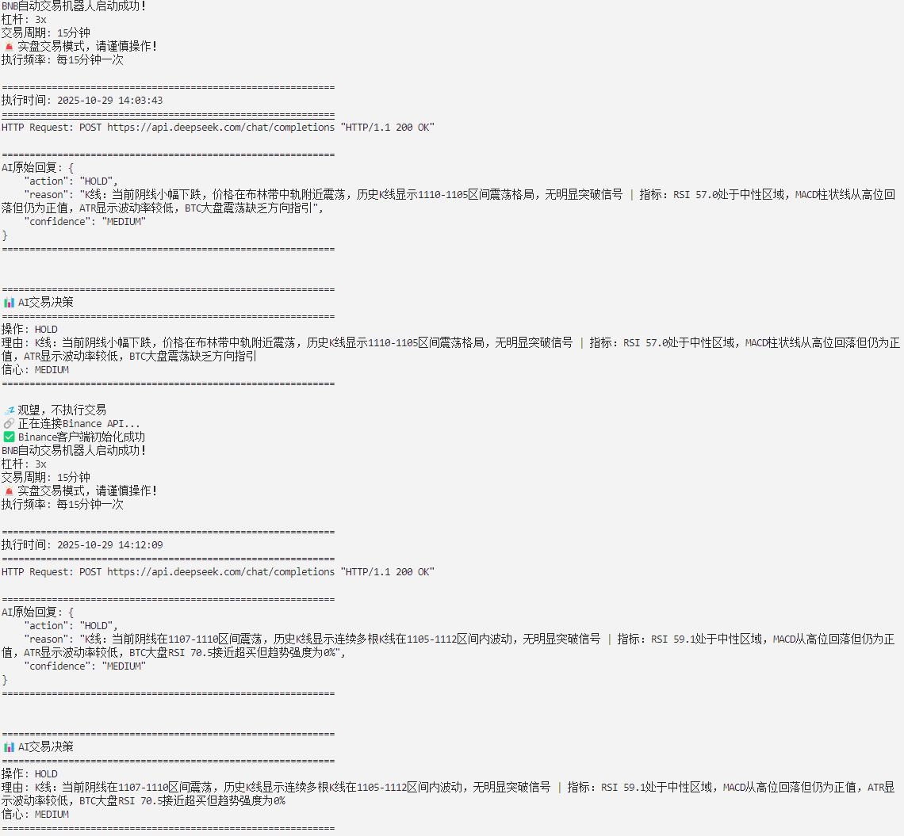

<div align="center">

# 🤖 AI自动交易机器人

### 单币种版本（多币种请运行多个实例）

[](https://python.org)
[](LICENSE)
[](https://binance.com)

**🚀 基于DeepSeek AI的智能交易机器人，使用币安原生库python-binance**

---

### 📖 语言选择 / Language Selection

| [🇨🇳 中文文档](README.md) | [🇺🇸 English](README_EN.md) |
|:---:|:---:|
| **简体中文** | **English** |

---

### 💰 如果您通过这个项目获得了收益，欢迎支持一下

**钱包地址 (BEP20/BSC)**

```
0x59B7c28c236E6017df28e7F376B84579872A4E33
```

<sub>您的支持是我持续更新的动力 ❤️</sub>

</div>

<br>

---

<br>

## 📦 开箱即用版（无编程基础用户专享）

<div align="center">

**🎁 为不懂编程的用户准备的傻瓜式部署包！**

</div>

<br>

如果你是**无编程基础**的用户，我们为你准备了开箱即用版本，只需3步即可启动：

<br>

### ✨ 开箱即用版特点

<table>
<tr>
<td width="50%">

**🚀 一键安装**
- 自动检测环境
- 自动安装依赖

**📝 详细文档**
- 5分钟快速开始
- 中英文双语支持

**🎨 彩色界面**
- Linux彩色终端
- 美观易读

</td>
<td width="50%">

**🚀 一键启动**
- 自动检查配置
- 自动启动程序

**🛡️ 傻瓜配置**
- .env详细注释
- 智能错误诊断

**🔧 后台运行**
- Linux后台支持
- 进程管理

</td>
</tr>
</table>

<br>

### 📥 下载开箱即用版

<div align="center">

📦 从 [**Releases**](https://github.com/xuanoooooo/ai-trading-bot/releases) 页面下载最新版本

**`AI交易机器人-开箱即用版.tar.gz`**

<sub>支持 Windows / Linux / Mac</sub>

</div>

<br>

### 🚀 3步快速启动

<details>
<summary><b>🪟 Windows用户（点击展开）</b></summary>

<br>

```
1️⃣ 解压压缩包

2️⃣ 双击运行 scripts/Windows系统一键安装.bat（首次使用）
   → 等待依赖安装完成

3️⃣ 双击运行 scripts/Windows系统一键启动.bat
   → 程序开始运行
```

</details>

<details>
<summary><b>🐧 Linux/Mac用户（点击展开）</b></summary>

<br>

```bash
# 1️⃣ 解压
tar -xzf AI交易机器人-开箱即用版.tar.gz
cd easy-setup

# 2️⃣ 配置API密钥
nano .env  # 填入你的DeepSeek和币安API密钥

# 3️⃣ 安装并启动
chmod +x scripts/*.sh
bash scripts/Linux系统一键安装.sh
bash scripts/Linux系统一键启动.sh
```

</details>

<br>

### 📖 开箱即用版包含内容

<details>
<summary><b>查看详细文件列表（点击展开）</b></summary>

<br>

```
AI交易机器人-开箱即用版/
├── 📄 使用说明-请先看我.txt          # 首页说明
├── 📄 README_快速开始.txt             # 中文快速指南
├── 📄 README_QUICK_START.txt          # 英文快速指南
├── 🔑 .env                             # API密钥配置（带详细注释）
├── 📋 requirements.txt                 # Python依赖
├── 📜 LICENSE                          # 开源许可证
│
├── 📁 src/
│   └── 🐍 deepseekBNB.py              # 主程序
│
├── 📁 scripts/
│   ├── 🪟 Windows系统一键安装.bat     # Windows安装脚本
│   ├── 🪟 Windows系统一键启动.bat     # Windows启动脚本
│   ├── 🐧 Linux系统一键安装.sh        # Linux安装脚本
│   └── 🐧 Linux系统一键启动.sh        # Linux启动脚本
│
└── 📁 config/
    └── 📖 配置说明.txt                 # 详细配置教程（9个章节）
```

</details>

<br>

<details>
<summary><h3 style="color: red; display: inline;">⚙️ 点击展开：详细配置教程</h3></summary>

<br>

打开 `src/deepseekBNB.py` 文件，找到第 **95-99** 行的 `TRADE_CONFIG` 配置：

```python
# 交易配置
TRADE_CONFIG = {
    'symbol': 'BNBUSDT',        # 交易对
    'leverage': 3,              # 杠杆倍数
    'min_order_qty': 0.01,      # 最小交易数量
}
```

<br>

#### 📝 各参数详细说明

<table>
<tr>
<th width="25%">参数名称</th>
<th width="35%">说明</th>
<th width="40%">修改示例</th>
</tr>

<tr>
<td><code>symbol</code></td>
<td>

**交易币种对**

决定交易哪个币种

</td>
<td>

```python
# 交易以太坊
'symbol': 'ETHUSDT'

# 交易比特币
'symbol': 'BTCUSDT'

# 交易SOL
'symbol': 'SOLUSDT'
```

</td>
</tr>

<tr>
<td><code>leverage</code></td>
<td>

**杠杆倍数**

默认3倍，范围1-125

⚠️ 杠杆越高风险越大

</td>
<td>

```python
# 保守：1倍（无杠杆）
'leverage': 1

# 适中：3倍（默认）
'leverage': 3

# 激进：10倍
'leverage': 10
```

</td>
</tr>

<tr>
<td><code>min_order_qty</code></td>
<td>

**最小开单数量**

不同币种要求不同

⚠️ 必须符合币安规则

</td>
<td>

```python
# BNB/SOL
'min_order_qty': 0.01

# BTC/ETH
'min_order_qty': 0.001

# DOGE
'min_order_qty': 1
```

**查询方法**：
访问 [币安合约交易规则](https://www.binance.com/zh-CN/futures/trading-rules/perpetual/leverage-margin)

</td>
</tr>

</table>

<br>

#### 💰 最小账户余额要求

找到第 **705** 行（开多仓）和第 **760** 行（开空仓）的余额检查：

```python
if balance and balance['available'] > 10:  # ← 最小10 USDT才能开仓
```

<table>
<tr>
<th width="30%">最小余额</th>
<th width="70%">修改方法</th>
</tr>

<tr>
<td>

**当前：10 USDT**

账户至少要有10 USDT才能开仓

</td>
<td>

```python
# 宽松：5 USDT就能开仓
if balance and balance['available'] > 5:

# 默认：10 USDT（推荐）
if balance and balance['available'] > 10:

# 严格：100 USDT才能开仓
if balance and balance['available'] > 100:
```

⚠️ **注意**：
- 需要同时修改两处（开多705行 + 开空760行）
- 设置太低可能导致开仓金额过小，不满足`min_order_qty`
- 建议至少保留10 USDT

</td>
</tr>

</table>

<br>

#### 🎯 AI动态开仓金额（v2.0新功能）

**AI现在会根据信号强度和信心程度自动决定开仓金额！**

无需手动配置，AI会在提示词指导下智能调整：
- **强信号高信心**：使用40-50%可用余额
- **中等信号中信心**：使用20-30%可用余额
- **弱信号低信心**：使用10-20%可用余额

程序会自动确保开仓金额不超过 `可用余额 × 杠杆倍数`

</table>

<br>

#### ⚠️ 重要提醒

<table>
<tr>
<td width="50%">

**🚫 不建议交易的币种**

- 单价 < 1 USDT 的币种
- 例如：SHIB、PEPE、FLOKI
- 原因：小数位过多，易产生精度错误

</td>
<td width="50%">

**✅ 推荐交易的币种**

- 主流币：BTC、ETH、BNB
- 中型币：SOL、DOGE、MATIC
- 单价 > 1 USDT，流动性好

</td>
</tr>
</table>

<br>

#### 📋 完整配置示例

<details>
<summary><b>示例1：交易以太坊（ETH）</b></summary>

```python
TRADE_CONFIG = {
    'symbol': 'ETHUSDT',      # 改为以太坊
    'leverage': 3,            # 保持3倍杠杆
    'min_order_qty': 0.001,   # ETH最小0.001
}

# 资金使用率保持30%
margin = balance['available'] * 0.3
```

</details>

<details>
<summary><b>示例2：保守交易比特币（BTC）</b></summary>

```python
TRADE_CONFIG = {
    'symbol': 'BTCUSDT',      # 比特币
    'leverage': 1,            # 降低到1倍（无杠杆）
    'min_order_qty': 0.001,   # BTC最小0.001
}

# 降低资金使用率到20%
margin = balance['available'] * 0.2
```

</details>

<details>
<summary><b>示例3：激进交易SOL</b></summary>

```python
TRADE_CONFIG = {
    'symbol': 'SOLUSDT',      # Solana
    'leverage': 5,            # 提高到5倍杠杆
    'min_order_qty': 0.01,    # SOL最小0.01
}

# 提高资金使用率到50%
margin = balance['available'] * 0.5
```

</details>

<br>

</details>

<br>

---

<br>

## 📦 项目定位

<div align="center">

**这是一个单币种AI交易系统**

<sub>多币种请同时运行多个程序实例</sub>

</div>

<br>

<table>
<tr>
<td width="33%" align="center">

**💰 单币种交易**

默认BNB/USDT合约

可自行修改币种

</td>
<td width="33%" align="center">

**🔄 多币种方案**

运行多个程序实例

每个实例交易一个币种

</td>
<td width="33%" align="center">

**⚡ 币安原生库**

python-binance

性能更优

</td>
</tr>
<tr>
<td width="33%" align="center">

**📊 BTC大盘参考**

市场情绪参考

辅助决策

</td>
<td width="66%" align="center" colspan="2">

**🛡️ 风险隔离建议**

强烈建议为每个币种创建独立的币安子账户，让AI独立操盘，有效隔离风险

<sub>多币种同时运行功能仍在测试中，待确认无风险后发布</sub>

</td>
</tr>
</table>

## ⚠️ **重要提示**

### 1. 必须使用单向持仓模式
**请确保您的币安账户设置为单向持仓模式（One-Way Mode），双向持仓模式（Hedge Mode）会导致交易失败！**

### 2. 网络访问说明
**⚠️ 美国IP和大陆IP无法访问币安API，请自行解决网络问题。本项目不会回复此类网络访问问题。**

### 3. 交易参数配置

<details>
<summary><h3 style="color: red; display: inline;">⚙️ 点击展开：详细配置教程</h3></summary>

<br>

打开 `src/deepseekBNB.py` 文件，找到第 **95-99** 行的 `TRADE_CONFIG` 配置：

```python
# 交易配置
TRADE_CONFIG = {
    'symbol': 'BNBUSDT',        # 交易对
    'leverage': 3,              # 杠杆倍数
    'min_order_qty': 0.01,      # 最小交易数量
}
```

<br>

#### 📝 各参数详细说明

<table>
<tr>
<th width="25%">参数名称</th>
<th width="35%">说明</th>
<th width="40%">修改示例</th>
</tr>

<tr>
<td><code>symbol</code></td>
<td>

**交易币种对**

决定交易哪个币种

</td>
<td>

```python
# 交易以太坊
'symbol': 'ETHUSDT'

# 交易比特币
'symbol': 'BTCUSDT'

# 交易SOL
'symbol': 'SOLUSDT'
```

</td>
</tr>

<tr>
<td><code>leverage</code></td>
<td>

**杠杆倍数**

默认3倍，范围1-125

⚠️ 杠杆越高风险越大

</td>
<td>

```python
# 保守：1倍（无杠杆）
'leverage': 1

# 适中：3倍（默认）
'leverage': 3

# 激进：10倍
'leverage': 10
```

</td>
</tr>

<tr>
<td><code>min_order_qty</code></td>
<td>

**最小开单数量**

不同币种要求不同

⚠️ 必须符合币安规则

</td>
<td>

```python
# BNB/SOL
'min_order_qty': 0.01

# BTC/ETH
'min_order_qty': 0.001

# DOGE
'min_order_qty': 1
```

**查询方法**：
访问 [币安合约交易规则](https://www.binance.com/zh-CN/futures/trading-rules/perpetual/leverage-margin)

</td>
</tr>

</table>

<br>

#### 💰 最小账户余额要求

找到第 **705** 行（开多仓）和第 **760** 行（开空仓）的余额检查：

```python
if balance and balance['available'] > 10:  # ← 最小10 USDT才能开仓
```

<table>
<tr>
<th width="30%">最小余额</th>
<th width="70%">修改方法</th>
</tr>

<tr>
<td>

**当前：10 USDT**

账户至少要有10 USDT才能开仓

</td>
<td>

```python
# 宽松：5 USDT就能开仓
if balance and balance['available'] > 5:

# 默认：10 USDT（推荐）
if balance and balance['available'] > 10:

# 严格：100 USDT才能开仓
if balance and balance['available'] > 100:
```

⚠️ **注意**：
- 需要同时修改两处（开多705行 + 开空760行）
- 设置太低可能导致开仓金额过小，不满足`min_order_qty`
- 建议至少保留10 USDT

</td>
</tr>

</table>

<br>

#### 🎯 AI动态开仓金额（v2.0新功能）

**AI现在会根据信号强度和信心程度自动决定开仓金额！**

无需手动配置，AI会在提示词指导下智能调整：
- **强信号高信心**：使用40-50%可用余额
- **中等信号中信心**：使用20-30%可用余额
- **弱信号低信心**：使用10-20%可用余额

程序会自动确保开仓金额不超过 `可用余额 × 杠杆倍数`

</table>

<br>

#### ⚠️ 重要提醒

<table>
<tr>
<td width="50%">

**🚫 不建议交易的币种**

- 单价 < 1 USDT 的币种
- 例如：SHIB、PEPE、FLOKI
- 原因：小数位过多，易产生精度错误

</td>
<td width="50%">

**✅ 推荐交易的币种**

- 主流币：BTC、ETH、BNB
- 中型币：SOL、DOGE、MATIC
- 单价 > 1 USDT，流动性好

</td>
</tr>
</table>

<br>

#### 📋 完整配置示例

<details>
<summary><b>示例1：交易以太坊（ETH）</b></summary>

```python
TRADE_CONFIG = {
    'symbol': 'ETHUSDT',      # 改为以太坊
    'leverage': 3,            # 保持3倍杠杆
    'min_order_qty': 0.001,   # ETH最小0.001
}

# 资金使用率保持30%
margin = balance['available'] * 0.3
```

</details>

<details>
<summary><b>示例2：保守交易比特币（BTC）</b></summary>

```python
TRADE_CONFIG = {
    'symbol': 'BTCUSDT',      # 比特币
    'leverage': 1,            # 降低到1倍（无杠杆）
    'min_order_qty': 0.001,   # BTC最小0.001
}

# 降低资金使用率到20%
margin = balance['available'] * 0.2
```

</details>

<details>
<summary><b>示例3：激进交易SOL</b></summary>

```python
TRADE_CONFIG = {
    'symbol': 'SOLUSDT',      # Solana
    'leverage': 5,            # 提高到5倍杠杆
    'min_order_qty': 0.01,    # SOL最小0.01
}

# 提高资金使用率到50%
margin = balance['available'] * 0.5
```

</details>

<br>

</details>

---

## 🚀 快速开始

```bash
# 1. 克隆项目
git clone https://github.com/yourusername/deepseek-trading-bot.git
cd deepseek-trading-bot

# 2. 安装依赖
pip install -r requirements.txt

# 3. 配置API密钥（创建.env文件）
cp config/env.example .env
# 编辑.env，填入你的API密钥

# 4. 启动交易（推荐使用脚本）
bash scripts/start_trading.sh

# 或直接运行
cd src && python deepseekBNB.py
```

---

## 📸 运行演示

<div align="center">



*✨ AI自动分析市场数据并给出交易决策 - 实时K线分析 + 多周期技术指标*

</div>

---

## 🔥 最新更新

### 🔮 **即将推出 - 3分钟超高频版本（测试中）**

> **⚡️ 为不在乎AI调用费用的用户准备的极速版本**

#### 🚨 重要说明
- ⏱️ **3分钟决策周期** - AI每3分钟分析一次市场并做出决策
- 💰 **AI调用成本更高** - 调用频率提升3倍以上（从10分钟降至3分钟）
- ⚠️ **市场噪音风险** - 超短周期可能导致频繁交易，需警惕市场噪音干扰
- 🧪 **测试阶段** - 目前在测试账户验证中，确认无风险后发布
- 🎯 **适用场景** - 适合追求极致响应速度、对交易成本不敏感的用户

**敬请期待！** 我们正在严格测试中，确保稳定性和安全性后会第一时间发布。

---

### 🚀 **v2.1.0 (2025-10-29) - 多时段分析重大升级**

> **⚡️ 这是一次重大功能升级！AI决策能力大幅提升！**

#### 📊 多时段技术分析（核心功能）

- ✨ **新增1小时周期数据** - 30根1小时K线（30小时历史）+ 最新10个指标趋势值
- 📈 **15分钟数据增强** - 16根15分钟K线（4小时历史）+ 最新10个指标趋势值 + 当前实时K线
- ⏰ **实时K线数据** - AI获取当前正在形成的K线（开盘价、当前价、最高/最低、成交量、已运行时间）
- 🎯 **多时段交叉验证** - 同时分析短期（15分钟）和中期（1小时），避免被短期波动误导
- 🧠 **AI智能对比** - 自动对比不同周期数据，识别真实趋势

**实际案例：**
```
AI决策理由：
"15分钟RSI 57.2处于中性区域，MACD从高位回落但仍为正值，
 1小时RSI 31.0显示超卖但价格未确认反弹，
 ATR显示波动率较低"
```
✅ AI能准确区分短期和中期信号，做出更理性的判断！

#### 🔧 同期优化

- 🔧 **移除AI硬性指导** - 删除"多头排列"/"震荡"等主观判断，100%客观数据
- 📊 **时间序列优化** - 明确标注所有数据"从旧→新"顺序
- 🔧 **修复.env加载路径** - 解决配置文件读取问题
- ✨ **启动脚本增强** - 支持系统Python3，无需虚拟环境
- ✅ **完整测试验证** - 多时段数据获取、AI分析质量全面测试通过

---

### ✨ **v2.0 (2025-10-27) - 核心特性**
- 📈 **16根K线数据** - 完整的4小时短期数据（16×15分钟）
- 🎯 **强制K线+指标分析** - AI必须同时分析K线形态和技术指标
- 📊 **当前K线实时数据** - AI可以看到正在形成的K线（开高低收、成交量、波动幅度）
- 🧠 **AI决策历史记忆** - AI能看到最近3次决策（45分钟历史），避免矛盾决策
- 💾 **交易历史本地保存** - 自动保存到trading_stats.json
- 📝 **AI决策日志** - 记录所有决策到ai_decisions.json
- 🔄 **Binance API重试机制** - 5次重试+30秒超时，自动处理临时网络问题
- 🌐 **BTC大盘参考** - 15分钟周期BTC数据作为市场情绪参考

---
---

## ✨ 核心特性

### 🧠 **AI驱动决策**
- **DeepSeek AI分析** - 基于先进大语言模型的智能市场分析
- **完全自主决策** - AI独立分析技术指标，无人工干预
- **连续决策记忆** - AI能看到最近3次决策，避免频繁反转

### 📊 **技术分析引擎**
- **多维度指标** - RSI、MACD、SMA20/50、布林带、ATR波动率
- **🚀 多时段分析** - 15分钟K线（短期）+ 1小时K线（中期），交叉验证避免误判
- **K线形态分析** - 16根历史K线（4小时历史数据） + 当前实时K线
- **时间序列数据** - 最近10个值的指标趋势（从旧→新，清晰展示趋势演变）
- **BTC大盘参考** - 比特币市场情绪作为辅助判断

### 🛡️ **风险管理系统**
- **固定杠杆** - 3倍杠杆，风险可控
- **资金管理** - 默认使用30%可用余额开仓
- **最小交易量** - 自动检查交易所最小交易要求（0.01 BNB）
- **网络重试** - API连接失败自动重试，提高稳定性

### 🔧 **技术架构**
- **币安原生库** - python-binance，性能优于CCXT
- **单币种专注** - 代码简洁，易于理解和二次开发
- **完整日志** - 自动轮转日志，最大10MB，保留3个备份
- **统计数据** - 实时胜率、盈亏、交易次数统计

---

## 📋 系统要求

- **Python**: 3.11+
- **操作系统**: Linux / macOS / Windows
- **API密钥**: 币安期货合约API（需要开通合约交易权限）

---

## 📁 项目结构

```
├── src/
│   ├── deepseekBNB.py              # 主交易程序
│   └── trading_statistics.py       # 交易统计模块
├── config/
│   ├── trading_config.json         # 交易配置文件
│   └── env.example                 # API密钥配置模板
├── scripts/
│   ├── start_trading.sh            # 启动脚本
│   └── setup.sh                    # 环境配置脚本
├── docs/
├── requirements.txt                # Python依赖
├── .env                            # API密钥（需自行创建）
└── README.md                       # 项目说明
```

---

## 🎯 AI交易决策流程

1. **数据获取** - 获取BNB市场数据和BTC大盘参考
2. **AI分析** - DeepSeek分析当前K线、历史K线、技术指标
3. **决策输出** - BUY_OPEN（开多）/ SELL_OPEN（开空）/ CLOSE（平仓）/ HOLD（观望）
4. **执行交易** - 根据决策执行相应操作
5. **记录保存** - 保存交易记录和AI决策日志

---

## 📊 数据文件说明

### `trading_stats.json` - 交易统计
- 总交易次数
- 胜率统计
- 总盈亏
- 最近200笔交易记录

### `ai_decisions.json` - AI决策日志
- 决策时间
- 操作类型
- 决策理由
- 信心程度

### `current_runtime.json` - 运行状态
- 程序启动时间
- AI调用次数
- 最后更新时间

---

## 🔍 监控和日志

```bash
# 查看实时日志
tail -f bnb_trader.log

# 查看AI决策
cat ai_decisions.json | jq '.decisions[-5:]'

# 查看交易统计
cat trading_stats.json | jq '.total_trades, .win_rate, .total_pnl'
```

---

## 🛡️ 风险提示

⚠️ **加密货币交易存在高风险，请谨慎使用：**

1. **资金风险** - 可能导致本金亏损
2. **杠杆风险** - 3倍杠杆会放大盈亏
3. **市场风险** - 市场波动可能导致快速亏损
4. **技术风险** - 网络问题或API故障可能影响交易
5. **AI决策风险** - AI决策不保证盈利

**建议：**
- ✅ 从小金额开始测试
- ✅ 定期检查账户和持仓
- ✅ 设置合理的止损策略
- ✅ 不要投入无法承受损失的资金

---

## 🐛 常见问题

### Q1: 如何修改交易币种（从BNB改为ETH/DOGE等）？
**A**: 请点击上方 **"⚙️ 点击展开：详细配置教程"** 查看完整的配置说明，包括如何修改交易币种、杠杆倍数、最小开单量、资金使用率等参数。

### Q2: API连接超时？
**A**: 检查网络连接，程序已内置5次重试机制。

### Q3: 如何切换到测试模式？
**A**: 修改`config/trading_config.json`中的`test_mode`为`true`。

---

## 📚 进阶使用

### 添加自定义指标
在`calculate_technical_indicators()`函数中添加新指标

### 调整AI提示词
修改`analyze_portfolio_with_ai()`中的`prompt`变量

### 多币种扩展
基于本项目架构扩展支持多币种交易

---

## 🤝 贡献

欢迎提交Issue和Pull Request！

---

## 📄 许可证

本项目采用 Apache 2.0 许可证

---

## ⚖️ 免责声明

本软件仅供学习和研究使用。使用本软件进行实盘交易的任何盈亏由用户自行承担。作者不对使用本软件造成的任何损失负责。

**加密货币交易具有高风险，请谨慎投资！**

---

## 💰 支持项目

如果您通过这个项目获得了收益，欢迎支持一下：

**钱包地址 (BEP20/BSC)**
```
0x59B7c28c236E6017df28e7F376B84579872A4E33
```

---

<div align="center">

**⭐ 如果这个项目对你有帮助，欢迎Star支持！⭐**

Made with ❤️ by AI Trading Community

</div>
