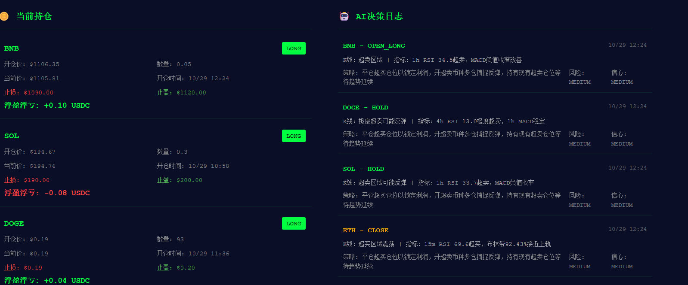
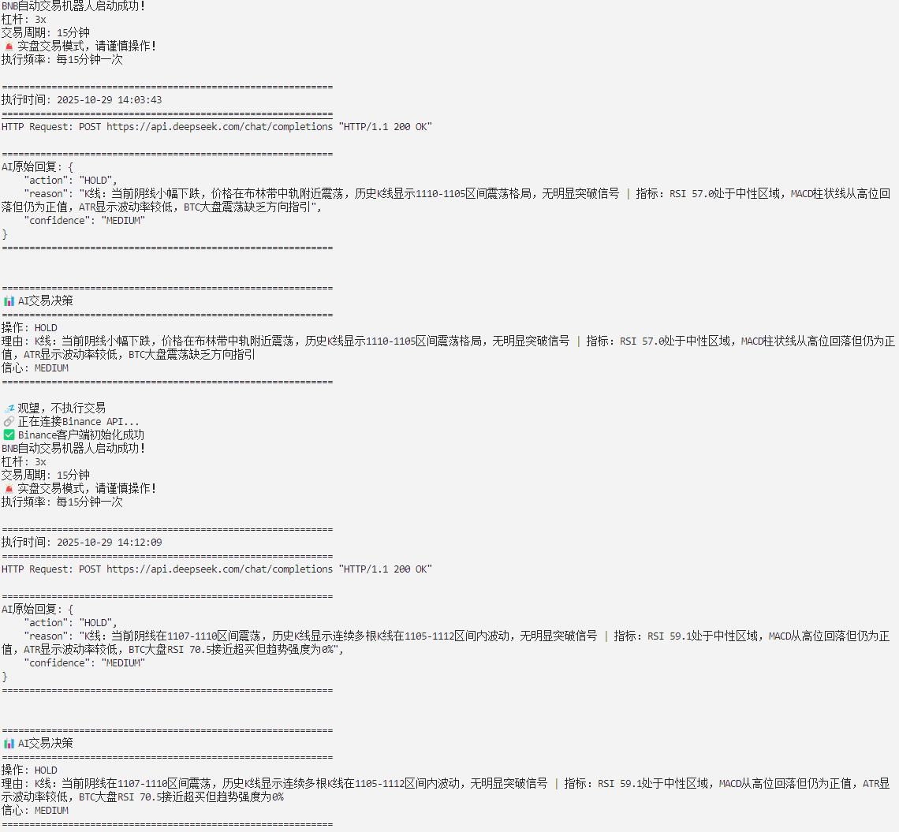

# 🤖 AI多币种自动交易系统

<div align="center">

**让AI替你盯盘交易**

[](https://www.python.org/)
[](LICENSE)
[](https://www.binance.com/)
[](https://www.deepseek.com/)

### 📖 选择语言

<table>
<tr>
<td width="50%" align="center">

### 🇨🇳 简体中文

[👉 查看中文完整文档](README_CN.md)

**多币种投资组合管理**  
**24/7全自动运行**  
**实时可视化看板**

</td>
<td width="50%" align="center">

### 🇺🇸 English

[👉 View Full English Docs](README_EN.md)

**Multi-Coin Portfolio Management**  
**24/7 Automated Trading**  
**Real-Time Dashboard**

</td>
</tr>
</table>

</div>

---

## 💭 作者的话

> *"经历了生活的大亏损、在币圈也没获得什么结果，我对自己的水平彻底失望。*  
> *与其每天假装看盘实则在赌，不如把决策交给AI——至少它不会因为行情波动而梭哈。*  
> *这个项目源于一个简单的期望：AI再不完美也比我强。"*

---

## 💰 支持项目

<div align="center">

**如果这个项目对你有帮助，欢迎支持**

**钱包地址 (BEP20/BSC)**
```
0x59B7c28c236E6017df28e7F376B84579872A4E33
```

您的支持是持续更新的动力 ❤️

**没有收费也没有挂邀请码，只求各位给星星** ⭐

</div>

---

## 📸 系统界面预览

### 🎨 Web可视化看板

**实时监控持仓和AI决策**



**看板功能：**
- 💰 **左侧**：当前持仓，实时盈亏
- 🤖 **右侧**：AI决策日志，分析理由
- 🎨 **深色主题**：护眼舒适
- 🔄 **自动刷新**：每30秒更新
- 💚💔 **颜色标识**：绿色盈利，红色亏损

---

### 💻 终端日志模式

**详细执行日志，适合服务器监控**



**日志功能：**
- 📝 **详细日志**：每次AI分析和交易执行
- 🔍 **实时显示**：SSH远程实时监控
- 💡 **轻量级**：资源占用极低
- 📊 **完整信息**：市场数据、决策、结果

---

---

## ⚠️ 重要提醒

**市场有风险，投资需谨慎。**

本项目仅供学习交流使用。

**⚠️ 币安账户必须设置：**
- ✅ **单向持仓模式**（One-way Mode）
- ❌ 不支持双向持仓（Hedge Mode）
- 💡 设置路径：币安合约 → 偏好设置 → 持仓模式

**🛡️ 强烈推荐：使用子账户隔离风险！**
- ✅ **创建独立子账户**专门用于机器人交易
- ✅ **转入有限资金**（如100-500 USDT测试）
- ✅ **主账户资金安全**，即使机器人出问题也不影响主账户
- 💡 设置方法：币安 → 用户中心 → 子账户管理 → 创建子账户

---

## 🎁 零基础快速上手（推荐新手）

**📢 完全没有编程基础？不用担心！**

我们为零基础用户准备了一键开箱版，开箱即用！

### 🚀 超简单启动（只需3步）

#### 第一步：下载开箱版

📦 **直接下载压缩包（推荐）：**

👉 [点击下载 ai-trading-bot-easy-setup-v2.4.2.tar.gz](https://github.com/xuanoooooo/ai-trading-bot/releases/latest)

或在项目页面找到 "Releases" → 下载最新版

**解压后目录：**
```
ai-trading-bot/
├── 一键开箱版/          ← 👈 打开这个文件夹！
│   ├── 【点我开始】使用说明.txt    ← 👈 双击查看
│   ├── start.bat                   ← 启动交易（Windows）
│   ├── start_dashboard.bat         ← 启动看板（Windows）
│   └── stop.bat                    ← 停止程序（Windows）
├── src/                 ← 程序代码
├── config/              ← 配置文件
└── .env                 ← 👈 需要修改这个文件
```

#### 第二步：获取API密钥

**1. DeepSeek密钥**（AI大脑，负责分析）
- 访问 https://platform.deepseek.com/
- 注册并登录后获取 API Key

**2. Binance密钥**（执行交易）
- 访问 https://www.binance.com/
- API管理 → 创建密钥
- ⚠️ 必须开通：合约交易 + 允许交易权限
- ⚠️ 必须设置：**单向持仓模式**

#### 第三步：配置并启动

**1. 修改 `.env` 文件**

找到项目根目录的 `.env` 文件，用记事本打开，填入3个密钥：

```bash
DEEPSEEK_API_KEY=sk-xxxxx        # 👈 填入DeepSeek密钥
BINANCE_API_KEY=xxxxx            # 👈 填入币安API Key  
BINANCE_SECRET=xxxxx             # 👈 填入币安Secret Key
```

保存并关闭。

**2. 启动程序**

**Windows用户（超简单）：**
- 进入 `一键开箱版/` 文件夹
- 双击 `start.bat` → 启动交易程序
- 双击 `start_dashboard.bat` → 启动看板（可选）
- 浏览器访问：http://localhost:5000

**Linux/Mac用户：**
```bash
bash scripts/start_trading.sh        # 启动交易
bash scripts/start_dashboard.sh      # 启动看板
```

### ✅ 默认配置（无需修改）

**已为您优化配置，强烈建议直接使用：**

| 配置项 | 默认值 | 说明 |
|--------|--------|------|
| 交易币种 | BTC, ETH, SOL, BNB, XRP, ADA, DOGE | 7个主流币种 |
| 杠杆倍数 | 3倍 | 稳健水平 |
| 扫描间隔 | 5分钟 | 捕获多周期K线变化 |
| AI模型 | deepseek-chat | 快速且便宜 |
| 保留资金 | 10% | 保留10%现金作为缓冲 |
| 单币最大仓位 | 100%（不限制） | AI自主决策仓位分配 |

### 💡 使用建议

**最低资金：** 100 USDT（建议 200-500 USDT）  
**首次使用：** 建议观察1-3天，了解AI决策逻辑  
**运行环境：** 云服务器最佳（24/7运行）

### 🆘 常见问题

**❓ 找不到文件？**  
→ 确保在 `ai-trading-bot` 文件夹内运行

**❓ API错误？**  
→ 检查 `.env` 文件中密钥是否正确（不要有空格）

**❓ 权限不足？**  
→ 检查币安API是否开通"合约交易"权限

**❓ 想了解更多？**  
→ 查看 `一键开箱版/README_开箱版.md` 或继续阅读下方完整文档

---


---

## 🎯 项目亮点

### 🆚 单币种 VS 多币种

| 特性 | 单币种版本 | 多币种版本（本项目）|
|------|----------|-----------------|
| **管理方式** | 只交易1个币 | **同时管理5-8个币种** ✨ |
| **风险** | 集中风险 | **分散风险** 🛡️ |
| **机会** | 单一机会 | **多市场捕捉** 📈 |
| **收益** | 依赖单币 | **更稳定** 💪 |

### 🔬 技术优势（区别于其他交易机器人）

| 特性 | 普通机器人 | 本项目 |
|------|----------|--------|
| **时段分析** | 单一周期（如15分钟） | **多周期交叉验证**：币种 5m+30m+2h，BTC 15m+1h+4h ✨ |
| **大盘参考** | 只看单币数据 | **每次都参考BTC大盘情绪** 🎯 |
| **决策依据** | 单一维度判断 | **短中长期结合**，避免被假突破误导 🛡️ |
| **可靠性** | 容易被短期波动欺骗 | **多时段互相验证**，更稳健 💪 |

**为什么多时段分析重要？**
- 📉 5分钟看涨 → 但30分钟/2小时发现下跌趋势 → AI会谨慎观望
- 📈 币种5m+30m+2h都看涨 → BTC的15m+1h+4h也看涨 → AI高信心开多
- 🎯 大幅降低假信号，提高胜率

---

## ✨ 核心功能

### 🧠 AI全自动决策
- DeepSeek AI智能分析
- 完全解放双手，24/7运行
- 自动开仓、平仓、止损止盈

### 📊 多币种管理
- 同时管理BTC、ETH、SOL等
- 智能资金分配
- 风险分散，不怕单币暴跌

### 🎨 实时看板
- Web界面直观展示
- 持仓、盈亏一目了然
- AI决策记录可查询

### 🛡️ 风险控制
- 单币种不超过20%
- 自动止损3%、止盈8%
- 最多持有5个币种

### 📈 技术分析（核心优势）
- **🌟 多时段交叉验证**：
  - 币种分析：5分钟（K线形态+技术指标） + 30分钟 + 2小时 三周期
  - BTC大盘分析：15分钟 + 1小时 + 4小时 三周期
- **🔥 短中长期结合**：短期捕捉机会，中期把握趋势，长期验证方向
- **📊 BTC大盘情绪**：每次决策都参考BTC走势，避免逆势操作
- **🎯 技术指标全面**：RSI、MACD、EMA、布林带、ATR波动率
- AI基于多维数据有理有据做决策

---

## 🚀 快速开始

### 步骤1：克隆项目

```bash
git clone https://github.com/xuanoooooo/ai-trading-bot.git
cd ai-trading-bot
```

### 步骤2：安装依赖

```bash
bash scripts/install.sh
# 或者
pip install -r requirements.txt
```

### 步骤3：配置

```bash
cp .env.example .env
nano .env  # 填入API密钥
```

**获取密钥：**
- DeepSeek: https://platform.deepseek.com/
- Binance: https://www.binance.com/ (需要开通合约交易)

**⚠️ 币安账户设置（重要！）：**
- ✅ 必须使用 **单向持仓模式**（One-way Mode）
- ❌ 不支持双向持仓（Hedge Mode）
- 💡 设置路径：币安合约 → 偏好设置 → 持仓模式

**⚠️ 重要提示：**
- ✅ 默认使用 `deepseek-chat`（快速且便宜）
- ✅ 默认币种：BTC、ETH、SOL、BNB、XRP、ADA、DOGE（USDT交易对）
- ✅ 建议使用默认配置
- ❌ 不要使用单价低于$1的币种（如SHIB）

---

### 🔧 配置说明

**📁 配置文件位置：** `config/coins_config.json`

#### 1️⃣ 币种配置

**默认币种（7个）：** BTC, ETH, SOL, BNB, XRP, ADA, DOGE

**如何添加新币种（例如添加 MATIC）：**

**添加前（默认7个币种）：**
```json
{
  "coins": [
    {"symbol": "BTC", "binance_symbol": "BTCUSDT", "precision": 3, "price_precision": 2, "min_order_value": 50},
    {"symbol": "ETH", "binance_symbol": "ETHUSDT", "precision": 3, "price_precision": 2, "min_order_value": 24},
    {"symbol": "SOL", "binance_symbol": "SOLUSDT", "precision": 1, "price_precision": 2, "min_order_value": 6},
    {"symbol": "BNB", "binance_symbol": "BNBUSDT", "precision": 2, "price_precision": 2, "min_order_value": 12},
    {"symbol": "XRP", "binance_symbol": "XRPUSDT", "precision": 0, "price_precision": 4, "min_order_value": 6},
    {"symbol": "ADA", "binance_symbol": "ADAUSDT", "precision": 0, "price_precision": 4, "min_order_value": 6},
    {"symbol": "DOGE", "binance_symbol": "DOGEUSDT", "precision": 0, "price_precision": 4, "min_order_value": 6}
  ]
}
```

**添加 MATIC 后（8个币种）：**
```json
{
  "coins": [
    {"symbol": "BTC", "binance_symbol": "BTCUSDT", "precision": 3, "price_precision": 2, "min_order_value": 50},
    {"symbol": "ETH", "binance_symbol": "ETHUSDT", "precision": 3, "price_precision": 2, "min_order_value": 24},
    {"symbol": "SOL", "binance_symbol": "SOLUSDT", "precision": 1, "price_precision": 2, "min_order_value": 6},
    {"symbol": "BNB", "binance_symbol": "BNBUSDT", "precision": 2, "price_precision": 2, "min_order_value": 12},
    {"symbol": "XRP", "binance_symbol": "XRPUSDT", "precision": 0, "price_precision": 4, "min_order_value": 6},
    {"symbol": "ADA", "binance_symbol": "ADAUSDT", "precision": 0, "price_precision": 4, "min_order_value": 6},
    {"symbol": "DOGE", "binance_symbol": "DOGEUSDT", "precision": 0, "price_precision": 4, "min_order_value": 6},
    {"symbol": "MATIC", "binance_symbol": "MATICUSDT", "precision": 0, "price_precision": 4, "min_order_value": 6}  ⬅️ 新增
  ]
}
```

**参数说明：**
- `symbol`: 币种简称（显示用）
- `binance_symbol`: 币安交易对（必须是 **USDT** 结尾）
- `precision`: 数量小数位（访问币安合约页面查看订单簿）
- `price_precision`: 价格小数位
- `min_order_value`: 该币种最小开仓金额（USDT）

**⚠️ 选币规则：**
- ✅ 必须是 USDT 交易对
- ✅ 币种单价 ≥ $1（避免 SHIB、PEPE 等低价币）
- ✅ 24h 交易量 > 1亿美元
- 💡 推荐：AVAX, LINK, DOT, ATOM, LTC, UNI

---

#### 2️⃣ 风控参数配置

在 `config/coins_config.json` 的 `portfolio_rules` 部分：

```json
"portfolio_rules": {
  "leverage": 3,                    // 杠杆倍数（1-5倍，建议3倍）
  "min_cash_reserve_percent": 10,   // 最低保留资金百分比（10 表示保留10%）
  "max_single_coin_percent": 100    // 单币种最大仓位百分比（100 表示不限制）
}
```

**参数说明：**

**`leverage`**: 杠杆倍数
- 3 = 使用 3 倍杠杆
- 建议 2-3 倍（过高风险大）

**`min_cash_reserve_percent`**: 最低保留资金百分比
- 10 = 保留 10% 可用资金不用于开仓
- 例如：总资金 100 USDT，设为 10，则至少保留 10 USDT，最多用 90 USDT 开仓
- 建议：10-20（保留 10-20% 作为缓冲）

**`max_single_coin_percent`**: 单币种最大仓位百分比
- 100 = 允许单币种使用 100% 可用资金（不限制）
- 50 = 单币种最多用 50% 可用资金
- 30 = 单币种最多用 30% 可用资金
- AI会在此限制内自主分配

**💡 建议配置：**
- 保守型：`leverage: 2`, `min_cash_reserve_percent: 20`, `max_single_coin_percent: 30`
- 均衡型：`leverage: 3`, `min_cash_reserve_percent: 10`, `max_single_coin_percent: 50`
- 激进型：`leverage: 5`, `min_cash_reserve_percent: 10`, `max_single_coin_percent: 100`

---

#### 3️⃣ 其他重要参数

在 `src/portfolio_manager.py` 的 `PORTFOLIO_CONFIG` 部分：

```python
PORTFOLIO_CONFIG = {
    'leverage': 3,                    # 杠杆倍数（与 coins_config.json 中保持一致）
    'check_interval_minutes': 5,      # 扫描间隔（5分钟）
    'test_mode': False                # False=实盘模式，True=测试模式
}
```

**参数说明：**
- `leverage`: 杠杆倍数（建议与 `coins_config.json` 中的 `leverage` 保持一致）
- `check_interval_minutes`: AI分析间隔（**不建议修改**）
  - 默认：5分钟
  - ⚠️ **修改会导致K线数据不匹配**：程序使用 **5分钟+30分钟+2小时**（币种）和 **15分钟+1小时+4小时**（BTC）进行多时段交叉验证，5分钟间隔正好匹配5分钟K线周期
  - 如果改为其他值（如10分钟），会错过5分钟K线的关键变化
- `test_mode`: 测试模式开关
  - `False`: 实盘模式，真实下单
  - `True`: 测试模式，只分析不下单（推荐新手先用测试模式）

**📖 更多配置详情：**
- [中文完整说明](README_CN.md#步骤4配置交易币种和ai模型)
- [English Guide](README_EN.md#4-configure-ai-model--trading-coins)

### 步骤4：启动交易程序

**使用脚本启动（推荐）**

```bash
# 启动交易程序
bash scripts/start_trading.sh
```

**或手动启动**

```bash
cd src
python3 portfolio_manager.py
```

**停止交易程序**

```bash
# 使用脚本停止（推荐）
bash scripts/stop_trading.sh

# 或手动停止
pkill -f portfolio_manager.py
```

---

### 步骤5：启动看板（可选）

**使用脚本启动（推荐）**

```bash
# 启动看板
bash scripts/start_dashboard.sh

# 访问: http://localhost:5000
# 或: http://服务器IP:5000
```

**停止看板**

```bash
# 使用脚本停止（推荐）
bash scripts/stop_dashboard.sh

# 或手动停止
pkill -f web_app.py
```

---

### 📋 快速命令参考

| 操作 | 命令 |
|------|------|
| 🚀 启动交易 | `bash scripts/start_trading.sh` |
| 🛑 停止交易 | `bash scripts/stop_trading.sh` |
| 🎨 启动看板 | `bash scripts/start_dashboard.sh` |
| 🛑 停止看板 | `bash scripts/stop_dashboard.sh` |
| 📊 查看日志 | `tail -f logs/portfolio_manager.log` |

---

## 💡 进阶使用：tmux后台运行（推荐）

**为什么使用tmux？**

如果您需要通过SSH远程连接服务器运行交易程序，**强烈建议使用tmux**：

### ✅ tmux的优势

| 场景 | 不使用tmux | 使用tmux |
|------|----------|---------|
| **SSH断开** | ❌ 程序停止运行 | ✅ 程序继续运行 |
| **查看日志** | ❌ 需要tail -f | ✅ 直接看终端输出 |
| **重新连接** | ❌ 无法恢复 | ✅ 一键重连，回到原来的位置 |
| **多窗口监控** | ❌ 需要多个SSH | ✅ 一个SSH内多个窗口 |

### 📝 tmux基本使用

**启动交易程序（tmux版）**

```bash
# 创建名为"portfolio"的tmux会话
tmux new -s portfolio

# 在tmux中启动交易程序（注意：需要先cd到项目的src目录）
cd ai-trading-bot/src
python3 portfolio_manager.py
```

**断开tmux（程序继续运行）**

```bash
# 按下快捷键：
Ctrl + B，然后按 D
# 这时候可以安全关闭SSH，程序依然运行
```

**重新连接查看**

```bash
# 重新SSH连接后，恢复tmux会话
tmux attach -t portfolio
# 立即看到程序实时输出，就像从未断开过
```

**其他常用命令**

```bash
# 查看所有tmux会话
tmux ls

# 停止程序并退出tmux
Ctrl + C（停止程序）
exit（退出tmux）

# 或者直接杀死会话
tmux kill-session -t portfolio
```

### 🎯 推荐使用场景

- ✅ **服务器部署**：程序需要长期运行
- ✅ **远程监控**：随时SSH连接查看实时日志
- ✅ **调试阶段**：方便观察AI决策过程
- ⚠️ **生产环境**：也可以使用systemd服务（更高级）

### ⚠️ 注意事项

- tmux不是必须的，如果您使用Docker或systemd也可以
- 如果只是本地运行，直接在终端运行即可
- 看板程序(dashboard)通常不需要tmux，后台运行即可

---


## 📊 工作原理

```
1️⃣ 市场扫描（每5分钟）
   ↓ 获取K线和技术指标
   
2️⃣ AI分析
   ↓ DeepSeek分析市场数据
   
3️⃣ 决策生成
   ↓ 开多/开空/平仓/持有
   
4️⃣ 风险检查
   ↓ 验证是否符合规则
   
5️⃣ 执行交易
   ↓ 通过币安API执行
   
6️⃣ 记录保存
   ↓ 保存决策和交易记录
```

---

## 🗂️ 项目结构

```
ai-trading-bot/
├── src/                          # 核心代码
│   ├── portfolio_manager.py     # 主程序
│   ├── market_scanner.py        # 市场扫描
│   └── portfolio_statistics.py  # 统计
├── dashboard/                    # Web看板
│   ├── web_app.py               # Flask应用
│   ├── static/                  # 静态文件
│   └── templates/               # 模板
├── config/                       # 配置
│   └── coins_config.json        # 币种配置
├── scripts/                      # 脚本
│   ├── install.sh               # 安装
│   ├── start_trading.sh         # 启动交易
│   └── start_dashboard.sh       # 启动看板
├── .env.example                  # 环境模板
└── requirements.txt              # 依赖
```

---

## 📚 完整文档

<table>
<tr>
<td width="50%" align="center">

### 🇨🇳 中文文档

**[📖 查看完整中文文档](README_CN.md)**

包含：
- 详细安装步骤
- 配置说明
- AI决策逻辑详解
- 监控命令大全
- 常见问题Q&A

</td>
<td width="50%" align="center">

### 🇺🇸 English Docs

**[📖 View Full English Docs](README_EN.md)**

Including:
- Detailed installation
- Configuration guide
- AI decision logic
- Monitoring commands
- FAQ

</td>
</tr>
</table>

---

## 🤝 贡献

欢迎贡献！

**开发计划：**
- [ ] 支持更多交易所（OKX、Bybit）
- [ ] Telegram通知
- [ ] 回测功能
- [ ] 移动端看板

---

## 💰 支持项目

<div align="center">

**如果这个项目对你有帮助，欢迎支持**

**钱包地址 (BEP20/BSC)**
```
0x59B7c28c236E6017df28e7F376B84579872A4E33
```

您的支持是持续更新的动力 ❤️

</div>

---

## 📄 许可证

Apache 2.0 许可证

---

## 📞 相关链接

- [🇨🇳 完整中文文档](README_CN.md)
- [🇺🇸 Full English Docs](README_EN.md)
- [📝 更新日志](CHANGELOG.md)
- [🐛 Issues](https://github.com/xuanoooooo/ai-trading-bot/issues)
- [🔀 Pull Requests](https://github.com/xuanoooooo/ai-trading-bot/pulls)

---

<div align="center">

**如果有帮助请给星！** ⭐

**没有收费，没有邀请码** 🌟

Made with ❤️ by AI Trading Community

</div>
