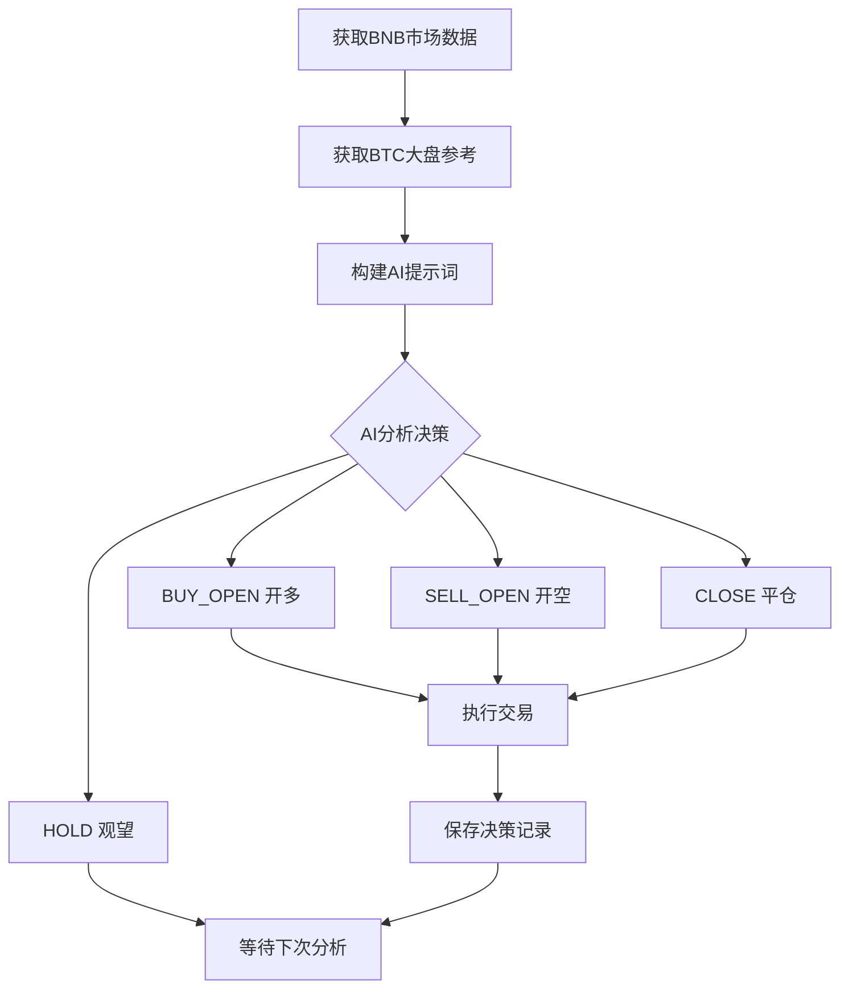

# 🤖 AI自动交易机器人 - BNB单币种版本（支持更换币种，详细请看说明）

[](https://python.org)
[](LICENSE)
[](https://binance.com)

> 🚀 **基于DeepSeek AI的BNB智能交易机器人，使用币安原生库python-binance**

## 📖 语言选择 / Language Selection

<div align="center">

| [🇨🇳 中文文档](README_CN.md) | [🇺🇸 English](README_EN.md) |
|:---:|:---:|
| **简体中文** | **English** |

</div>

---

## ⚠️ **重要提示**

### 1. 必须使用单向持仓模式
**请确保您的币安账户设置为单向持仓模式（One-Way Mode），双向持仓模式（Hedge Mode）会导致交易失败！**

### 2. 网络访问说明
**⚠️ 美国IP和大陆IP无法访问币安API，请自行解决网络问题。本项目不会回复此类网络访问问题。**

---

## 💰 如果您通过这个项目获得了收益，欢迎支持一下

**钱包地址 (BEP20/BSC)**
```
0x59B7c28c236E6017df28e7F376B84579872A4E33
```

---

## 📦 项目定位

这是一个**精简的单币种AI交易系统**，专注于：
- ✅ **单币种交易** - 专注BNB/USDT合约交易
- ✅ **币安原生库** - 使用python-binance库（非CCXT），性能更优
- ✅ **BTC大盘参考** - 保留比特币作为市场情绪参考

**适合场景**：
- 学习AI交易系统原理
- 单币种专注交易
- 服务器后台自动化运行
- 二次开发的基础代码

---

## 🔥 最新更新 (2025-10-27)

### ✨ **v2.0 核心特性**
- 📈 **16根K线数据** - 完整的4小时短期数据（16×15分钟）
- 🎯 **强制K线+指标分析** - AI必须同时分析K线形态和技术指标
- 📊 **当前K线实时数据** - AI可以看到正在形成的K线（开高低收、成交量、波动幅度）
- 🧠 **AI决策历史记忆** - AI能看到最近3次决策（45分钟历史），避免矛盾决策
- 💾 **交易历史本地保存** - 自动保存到trading_stats.json
- 📝 **AI决策日志** - 记录所有决策到ai_decisions.json
- 🔄 **Binance API重试机制** - 5次重试+30秒超时，自动处理临时网络问题
- 🌐 **BTC大盘参考** - 15分钟周期BTC数据作为市场情绪参考

---

## ✨ 核心特性

### 🧠 **AI驱动决策**
- **DeepSeek AI分析** - 基于先进大语言模型的智能市场分析
- **完全自主决策** - AI独立分析技术指标，无人工干预
- **连续决策记忆** - AI能看到最近3次决策，避免频繁反转

### 📊 **技术分析引擎**
- **多维度指标** - RSI、MACD、SMA20/50、布林带、ATR波动率
- **K线形态分析** - 16根历史K线 + 当前实时K线
- **时间序列数据** - 最近10个值的指标趋势
- **BTC大盘参考** - 比特币市场情绪作为辅助判断

### 🛡️ **风险管理系统**
- **固定杠杆** - 3倍杠杆，风险可控
- **资金管理** - 默认使用30%可用余额开仓
- **最小交易量** - 自动检查交易所最小交易要求（0.01 BNB）
- **网络重试** - API连接失败自动重试，提高稳定性

### 🔧 **技术架构**
- **币安原生库** - python-binance，性能优于CCXT
- **单币种专注** - 代码简洁，易于理解和二次开发
- **完整日志** - 自动轮转日志，最大10MB，保留3个备份
- **统计数据** - 实时胜率、盈亏、交易次数统计

---

## 📋 系统要求

- **Python**: 3.11+
- **操作系统**: Linux / macOS / Windows
- **API密钥**: 币安期货合约API（需要开通合约交易权限）

---

## 🚀 快速开始

### 1. 克隆项目

```bash
git clone https://github.com/yourusername/deepseek-trading-bot.git
cd deepseek-trading-bot
```

### 2. 安装依赖

```bash
pip install -r requirements.txt
```

### 3. 配置API密钥

在项目根目录创建`.env`文件：

```env
# 币安API密钥
BINANCE_API_KEY=your_binance_api_key_here
BINANCE_SECRET=your_binance_secret_key_here

# DeepSeek API密钥
DEEPSEEK_API_KEY=your_deepseek_api_key_here
```

### 4. 检查币安账户设置

⚠️ **重要**：登录币安，进入合约交易，确保：
- ✅ 持仓模式设置为**单向持仓**（One-Way Mode）
- ✅ 已开通合约交易权限
- ✅ BNB/USDT合约杠杆设置为3倍或更低

### 5. 启动交易程序

```bash
cd src
python deepseekBNB.py
```

或使用提供的启动脚本：

```bash
bash scripts/start_trading.sh
```

---

## 📁 项目结构

```
├── src/
│   ├── deepseekBNB.py              # 主交易程序
│   └── trading_statistics.py       # 交易统计模块
├── config/
│   ├── trading_config.json         # 交易配置文件
│   └── env.example                 # API密钥配置模板
├── scripts/
│   ├── start_trading.sh            # 启动脚本
│   └── setup.sh                    # 环境配置脚本
├── docs/
│   ├── 币种配置说明.md             # 如何修改交易币种（重要）
│   └── COIN_CONFIG.md              # Coin configuration guide (EN)
├── requirements.txt                # Python依赖
├── .env                            # API密钥（需自行创建）
└── README.md                       # 项目说明
```

---

## 🎯 AI交易决策流程



---

## ⚙️ 配置说明

### 交易配置 (`config/trading_config.json`)

```json
{
  "trading": {
    "symbol": "BNBUSDT",        // 交易对
    "leverage": 3,               // 杠杆倍数
    "min_order_qty": 0.01,       // 最小交易数量
    "test_mode": false           // 测试模式（true=模拟，false=实盘）
  },
  "position_management": {
    "default_position_percent": 30,  // 默认仓位百分比
    "max_position_percent": 50,      // 最大仓位百分比
    "reserve_percent": 20            // 预留资金百分比
  },
  "risk_management": {
    "max_daily_loss_percent": 10,    // 最大日亏损
    "max_consecutive_losses": 5      // 最大连续亏损次数
  }
}
```

### 核心参数说明

| 参数 | 说明 | 推荐值 |
|------|------|--------|
| `symbol` | 交易对 | BNBUSDT |
| `leverage` | 杠杆倍数 | 3 |
| `default_position_percent` | 默认仓位比例 | 30% |
| `test_mode` | 测试模式 | false（实盘）|

---

## 📊 数据文件说明

程序运行后会自动生成以下文件：

### `trading_stats.json` - 交易统计
```json
{
  "total_trades": 10,
  "winning_trades": 7,
  "losing_trades": 3,
  "win_rate": 70.0,
  "total_pnl": 125.50,
  "start_time": "2025-10-27T10:00:00",
  "trades": []  // 最近200笔交易记录
}
```

### `ai_decisions.json` - AI决策日志
```json
{
  "decisions": [
    {
      "time": "2025-10-27T10:15:00",
      "coin": "BNB",
      "action": "BUY_OPEN",
      "reason": "K线：突破阻力位 | 指标：RSI 65上行，MACD金叉",
      "confidence": "HIGH"
    }
  ]
}
```

### `current_runtime.json` - 运行状态
```json
{
  "program_start_time": "2025-10-27T10:00:00",
  "invocation_count": 24,
  "last_update": "2025-10-27T16:00:00"
}
```

---

## 🔍 监控和日志

### 日志文件
- **位置**: `bnb_trader.log`
- **大小**: 最大10MB，自动轮转
- **备份**: 保留3个历史文件

### 实时监控

```bash
# 查看实时日志
tail -f bnb_trader.log

# 查看AI决策
cat ai_decisions.json | jq '.decisions[-5:]'  # 最近5条

# 查看交易统计
cat trading_stats.json | jq '.total_trades, .win_rate, .total_pnl'
```

---

## 🛡️ 风险提示

⚠️ **加密货币交易存在高风险，请谨慎使用：**

1. **资金风险** - 可能导致本金亏损
2. **杠杆风险** - 3倍杠杆会放大盈亏
3. **市场风险** - 市场波动可能导致快速亏损
4. **技术风险** - 网络问题或API故障可能影响交易
5. **AI决策风险** - AI决策不保证盈利

**建议：**
- ✅ 从小金额开始测试
- ✅ 定期检查账户和持仓
- ✅ 设置合理的止损策略
- ✅ 不要投入无法承受损失的资金

---

## 🐛 常见问题

### Q1: 如何修改交易币种（从BNB改为ETH/DOGE等）？
**A**: 详见 **[📖 币种配置说明文档](docs/币种配置说明.md)**，包含完整步骤和常见币种配置。

### Q2: 提示"Precision error"错误？
**A**: 确保交易数量符合币安精度要求（BNB为0.01的倍数）。代码已自动处理精度。详见币种配置文档。

### Q3: API连接超时？
**A**: 检查网络连接，程序已内置5次重试机制。如仍失败，可能需要代理。

### Q4: 如何切换到测试模式？
**A**: 修改`config/trading_config.json`中的`test_mode`为`true`。

---

## 📚 进阶使用

### 添加自定义指标

在`calculate_technical_indicators()`函数中添加：

```python
# 示例：添加EMA指标
df['ema_9'] = df['close'].ewm(span=9).mean()
```

### 调整AI提示词

修改`analyze_portfolio_with_ai()`中的`prompt`变量来调整AI的分析方式。

### 多币种扩展

本项目为单币种版本。如需多币种，建议：
1. 创建币种配置列表
2. 循环遍历每个币种
3. 为每个币种独立调用AI分析

---

## 🤝 贡献

欢迎提交Issue和Pull Request！

---

## 📄 许可证

本项目采用 Apache 2.0 许可证 - 详见 [LICENSE](LICENSE) 文件

---

## ⚖️ 免责声明

本软件仅供学习和研究使用。使用本软件进行实盘交易的任何盈亏由用户自行承担。作者不对使用本软件造成的任何损失负责。

**加密货币交易具有高风险，请谨慎投资！**

---

## 📞 联系方式

- **GitHub Issues**: [提交问题](https://github.com/yourusername/deepseek-trading-bot/issues)
- **钱包地址**: `0x59B7c28c236E6017df28e7F376B84579872A4E33` (BEP20/BSC)

---

## 💰 支持项目

如果您通过这个项目获得了收益，欢迎支持一下：

**钱包地址 (BEP20/BSC)**
```
0x59B7c28c236E6017df28e7F376B84579872A4E33
```

---

<div align="center">

**⭐ 如果这个项目对你有帮助，欢迎Star支持！⭐**

Made with ❤️ by AI Trading Community

</div>
