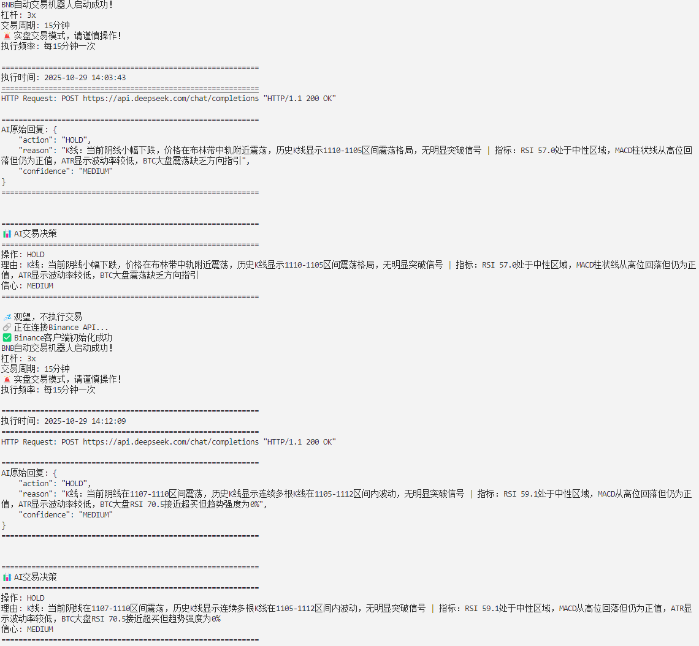

> **💭 Author's Note**  
> *"After countless cycles of chasing pumps and panic selling, I completely lost faith in my own trading ability.*  
> *Instead of being controlled by fear and greed, why not let AI make decisions—at least it won't lose sleep over market volatility.*  
> *This project stems from a simple belief: No matter how imperfect AI is, it's still more rational than an emotionally-driven me."*
> 
> **⚠️ Important Reminder**  
> AI trading **does NOT guarantee profits**. Markets are risky, invest wisely.  
> This project is for educational purposes only. Users assume all trading risks.  
> Approach AI decisions rationally, manage position sizes properly, and never blindly trust.

---
There are no fees or referral codes. I'd be very grateful for a star on GitHub.
-
# 🤖 AI Trading Bot - Single Coin Per Instance (Run Multiple Instances for Multi-Coin Trading)

## 📖 Language Selection / 语言选择

<div align="center">

| [🇺🇸 English](README_EN.md) | [🇨🇳 中文文档](README_CN.md) |
|:---:|:---:|
| **English** | **简体中文** |

</div>

---

[](https://python.org)
[](LICENSE)
[](https://binance.com)

> 🚀 **Intelligent cryptocurrency trading bot powered by DeepSeek AI with dynamic position management and fully automated trading decisions**

---

## ⚠️ Important - Read Before Use

<div align="center">

**🚨 Critical! Complete these settings before starting, or trading will fail or cause losses!**

</div>

<br>

<table>
<tr>
<td width="5%" align="center">🔴</td>
<td width="25%"><b>Must Use One-Way Mode</b></td>
<td width="70%">

Binance account **must be set to One-Way Position Mode**

❌ Hedge Mode will cause trading failures

📍 Path: Binance Futures → Preferences → Position Mode → One-Way Mode

</td>
</tr>

<tr>
<td align="center">🔴</td>
<td><b>Must Check Min Order Quantity</b></td>
<td>

**Different coins have different minimum order quantities (in coin amount, NOT USDT!)**

- BNB/SOL: Min 0.01 coins
- BTC/ETH: Min 0.001 coins  
- DOGE: Min 1 coin

📍 Modify at: `src/deepseekBNB.py` Line 95 `min_order_qty`

🔗 Check at: [Binance API Docs](https://binance-docs.github.io/apidocs/futures/en/) or Binance Futures page

</td>
</tr>

<tr>
<td align="center">🔴</td>
<td><b>Must Enable API Permissions</b></td>
<td>

**Binance API key must have "Futures Trading" permission enabled**

❌ Only "Spot Trading" permission will cause all trades to fail

📍 Path: Binance → API Management → Edit Restrictions → Enable Futures

⚠️ Recommend enabling IP whitelist for security

</td>
</tr>

<tr>
<td align="center">🟡</td>
<td><b>Recommend Test Mode First</b></td>
<td>

**Strongly recommend enabling test mode for first-time use**

📍 Modify at: `src/deepseekBNB.py` Line 99 `'test_mode': True`

✅ Test mode analyzes normally but **does NOT place actual orders**, verifies configuration

</td>
</tr>

<tr>
<td align="center">🟡</td>
<td><b>Ensure Sufficient Balance</b></td>
<td>

**Minimum requirement: At least 10 USDT + value of one minimum order**

Example for BNB (price 600 USDT, min qty 0.01):
- Min order value = 600 × 0.01 = 6 USDT
- Recommended balance ≥ 10 + 6 = **16 USDT**

📍 Modify min balance at: `src/deepseekBNB.py` Lines 705 and 760

</td>
</tr>

<tr>
<td align="center">🟡</td>
<td><b>Avoid Low-Price Coins</b></td>
<td>

**Not recommended for coins priced below 1 USDT**

❌ Like SHIB, PEPE (too many decimals, precision errors)

✅ Recommended: BNB, ETH, SOL, BTC and other major coins

</td>
</tr>

<tr>
<td align="center">🟡</td>
<td><b>Network Access Required</b></td>
<td>

**⚠️ US IP and Mainland China IP cannot access Binance API directly**

Please solve network issues yourself (this project does not provide network solutions)

</td>
</tr>

<tr>
<td align="center">🟢</td>
<td><b>Recommend Using Sub-Account</b></td>
<td>

**Recommend using Binance sub-account for risk isolation**

✅ Main account funds safe + sub-account dedicated to AI trading

📍 Create at: Binance → Account Management → Sub-Account Management

</td>
</tr>

</table>

<br>

---

## 📦 Easy Setup Version (For Non-Programmers)

> **🎁 Foolproof deployment package for users without programming experience!**

If you are a user **without programming experience**, we have prepared a ready-to-use version that can be started in just 3 steps:

### ✨ Easy Setup Features

- 🚀 **One-Click Installation** - Auto-detect environment, auto-install dependencies
- 🚀 **One-Click Startup** - Auto-check configuration, auto-start program
- 📝 **Detailed Documentation** - 5-minute quick start guide (Chinese & English)
- 🛡️ **Foolproof Configuration** - .env file with detailed Chinese annotations
- 💡 **Smart Detection** - Auto-diagnose issues and provide solutions
- 🎨 **Colorful Interface** - Linux version supports colorful terminal output
- 🔧 **Background Running** - Linux supports background running and process management

### 📥 Download Easy Setup Version

Download from [Releases](https://github.com/xuanoooooo/ai-trading-bot/releases) page:
- **`AI交易机器人-开箱即用版.tar.gz`** (Recommended, supports Windows/Linux/Mac)

Or get it directly from the project:
```bash
# After downloading the project, the easy setup version is located at:
./GitHub发布版/AI交易机器人-无编程基础用户版.tar.gz
```

### 🚀 3-Step Quick Start

#### Windows Users:
```
1. Extract the archive
2. Double-click scripts/Windows系统一键安装.bat (first time only)
3. Double-click scripts/Windows系统一键启动.bat
```

#### Linux/Mac Users:
```bash
# 1. Extract
tar -xzf AI交易机器人-开箱即用版.tar.gz
cd easy-setup

# 2. Configure API Keys
nano .env  # Fill in your DeepSeek and Binance API keys

# 3. Install and Start
chmod +x scripts/*.sh
bash scripts/Linux系统一键安装.sh
bash scripts/Linux系统一键启动.sh
```

### 📖 Easy Setup Package Contents

```
AI Trading Bot - Easy Setup/
├── 使用说明-请先看我.txt          # Homepage instructions
├── README_快速开始.txt             # Chinese quick guide
├── README_QUICK_START.txt          # English quick guide
├── .env                             # API key configuration (with detailed comments)
├── requirements.txt                 # Python dependencies
├── LICENSE                          # Open source license
│
├── src/
│   └── deepseekBNB.py              # Main program
│
├── scripts/
│   ├── Windows系统一键安装.bat     # Windows installation script
│   ├── Windows系统一键启动.bat     # Windows startup script
│   ├── Linux系统一键安装.sh        # Linux installation script
│   └── Linux系统一键启动.sh        # Linux startup script
│
└── config/
    └── 配置说明.txt                 # Detailed configuration tutorial (9 chapters)
```

<details>
<summary><h3 style="color: red; display: inline;">⚙️ Click to Expand: Detailed Configuration Guide</h3></summary>

<br>

Open `src/deepseekBNB.py` file, find the `TRADE_CONFIG` configuration at lines **95-99**:

```python
# Trading Configuration
TRADE_CONFIG = {
    'symbol': 'BNBUSDT',        # Trading pair
    'leverage': 3,              # Leverage multiplier
    'min_order_qty': 0.01,      # Minimum order quantity
}
```

<br>

#### 📝 Parameter Details

<table>
<tr>
<th width="25%">Parameter</th>
<th width="35%">Description</th>
<th width="40%">Examples</th>
</tr>

<tr>
<td><code>symbol</code></td>
<td>

**Trading Pair**

Determines which coin to trade

</td>
<td>

```python
# Trade Ethereum
'symbol': 'ETHUSDT'

# Trade Bitcoin
'symbol': 'BTCUSDT'

# Trade SOL
'symbol': 'SOLUSDT'
```

</td>
</tr>

<tr>
<td><code>leverage</code></td>
<td>

**Leverage Multiplier**

Default 3x, range 1-125

⚠️ Higher leverage = Higher risk

</td>
<td>

```python
# Conservative: 1x (no leverage)
'leverage': 1

# Moderate: 3x (default)
'leverage': 3

# Aggressive: 10x
'leverage': 10
```

</td>
</tr>

<tr>
<td><code>min_order_qty</code></td>
<td>

**Minimum Order Quantity**

Varies by coin

⚠️ Must comply with Binance rules

</td>
<td>

```python
# BNB/SOL
'min_order_qty': 0.01

# BTC/ETH
'min_order_qty': 0.001

# DOGE
'min_order_qty': 1
```

**How to check**:
Visit [Binance Futures Trading Rules](https://www.binance.com/en/futures/trading-rules/perpetual/leverage-margin)

</td>
</tr>

</table>

<br>

#### 💰 Minimum Account Balance Requirement

> **🤔 Why do we need minimum balance? What's the difference from `min_order_qty`?**
> 
> These are two different limits:
> - **`min_order_qty` (Minimum Order Quantity)**: Binance's hard requirement, minimum coins per order (e.g., 0.01 BNB)
> - **`balance > 10` (Minimum Account Balance)**: Our risk control, minimum USDT in account to allow trading
> 
> **Why do we need balance limit?**
> 
> | Scenario | Balance | BNB Price | Without Balance Limit | With Balance Limit (>10) |
> |----------|---------|-----------|----------------------|-------------------------|
> | **Tiny Account** | 5 USDT | 1100 | Try to open → 💥 Order fails<br>(0.01 BNB = 11 USDT > 5 USDT) | ❌ Reject order<br>✅ Avoid failure |
> | **Barely Enough** | 12 USDT | 1100 | Open 11 USDT → ⚠️ 1U left<br>10% move = liquidation | ❌ Reject order<br>✅ Protect funds |
> | **Sufficient** | 50 USDT | 1100 | ✅ Normal trading | ✅ Normal trading |
> 
> **Summary**: Balance limit prevents trading with tiny accounts, avoiding order failures and easy liquidations!

<br>

Find lines **705** (long position) and **760** (short position):

```python
if balance and balance['available'] > 10:  # ← Minimum 10 USDT required
```

<table>
<tr>
<th width="30%">Minimum Balance</th>
<th width="70%">How to Modify</th>
</tr>

<tr>
<td>

**Current: 10 USDT**

Account must have at least 10 USDT to open positions

</td>
<td>

```python
# Loose: 5 USDT (not recommended, high liquidation risk)
if balance and balance['available'] > 5:

# Default: 10 USDT (recommended for BNB)
if balance and balance['available'] > 10:

# Conservative: 20 USDT (safer)
if balance and balance['available'] > 20:

# Strict: 100 USDT (for large coins like BTC)
if balance and balance['available'] > 100:
```

⚠️ **Note**:
- Must modify BOTH places (long 705 + short 760)
- Setting too low may cause:
  - Order value < Binance minimum → Order fails
  - Remaining margin too small → Easy liquidation
- **Adjust based on trading coin**:
  - BNB/SOL (price~1000): Suggest ≥ 20 USDT
  - ETH (price~3000): Suggest ≥ 50 USDT
  - BTC (price~60000): Suggest ≥ 100 USDT

</td>
</tr>

</table>

<br>

#### 🎯 AI Dynamic Position Sizing (v2.0 Feature)

**AI now automatically determines position size based on signal strength and confidence!**

No manual configuration needed. AI adjusts intelligently:
- **Strong signal + High confidence**: Uses 40-50% of available balance
- **Medium signal + Medium confidence**: Uses 20-30% of available balance
- **Weak signal + Low confidence**: Uses 10-20% of available balance

The program automatically ensures position size doesn't exceed `Available Balance × Leverage`

</table>

<br>

#### ⚠️ Important Reminders

<table>
<tr>
<td width="50%">

**🚫 Not Recommended Coins**

- Price < 1 USDT
- Examples: SHIB, PEPE, FLOKI
- Reason: Too many decimals cause precision errors

</td>
<td width="50%">

**✅ Recommended Coins**

- Major coins: BTC, ETH, BNB
- Mid-cap coins: SOL, DOGE, MATIC
- Price > 1 USDT, good liquidity

</td>
</tr>
</table>

<br>

#### 📋 Complete Configuration Examples

<details>
<summary><b>Example 1: Trading Ethereum (ETH)</b></summary>

```python
TRADE_CONFIG = {
    'symbol': 'ETHUSDT',      # Switch to Ethereum
    'leverage': 3,            # Keep 3x leverage
    'min_order_qty': 0.001,   # ETH minimum 0.001
}

# Keep 30% capital usage
margin = balance['available'] * 0.3
```

</details>

<details>
<summary><b>Example 2: Conservative Bitcoin (BTC) Trading</b></summary>

```python
TRADE_CONFIG = {
    'symbol': 'BTCUSDT',      # Bitcoin
    'leverage': 1,            # Reduce to 1x (no leverage)
    'min_order_qty': 0.001,   # BTC minimum 0.001
}

# Reduce capital usage to 20%
margin = balance['available'] * 0.2
```

</details>

<details>
<summary><b>Example 3: Aggressive SOL Trading</b></summary>

```python
TRADE_CONFIG = {
    'symbol': 'SOLUSDT',      # Solana
    'leverage': 5,            # Increase to 5x leverage
    'min_order_qty': 0.01,    # SOL minimum 0.01
}

# Increase capital usage to 50%
margin = balance['available'] * 0.5
```

</details>

<br>

</details>

---

## 🔥 Latest Updates

### 🎯 **v2.2.0 (2025-10-30) - AI Dynamic Position Management**

> **🚀 Major Upgrade: AI can now intelligently determine position size!**

#### 💡 Core Features

- ✨ **AI Dynamic Position Sizing** - Autonomously decides how much capital to use based on signal strength and confidence
- 🎚️ **Intelligent Position Strategy**:
  - Strong signal + High confidence: Uses 40-50% of available balance
  - Medium signal + Medium confidence: Uses 20-30% of available balance
  - Weak signal + Low confidence: Uses 10-20% of available balance
- 🛡️ **Strict Boundary Protection**:
  - Lower limit: Must meet Binance `min_order_qty` requirement (e.g., 0.01 BNB)
  - Upper limit: Cannot exceed `Available Balance × Leverage`
  - Auto-adjustment: Automatically limits to safe range when AI suggests exceeding limits
- 📊 **New Output Fields**:
  - `position_value`: Position amount (USDT)
  - `risk_level`: Risk level (HIGH/MEDIUM/LOW)
  - `confidence`: Confidence level (HIGH/MEDIUM/LOW)
- 📝 **Complete Logging**: Shows AI suggested amount vs actual amount used

#### 📋 Real Example

```json
{
    "action": "BUY_OPEN",
    "position_value": 1500,  // AI decides to use 1500 USDT
    "confidence": "HIGH",
    "risk_level": "LOW",
    "reason": "Candle: Strong breakout... | Indicators: RSI oversold reversal..."
}
```

**Upgrade Highlight:** No longer fixed 30% position - AI flexibly adjusts based on market conditions!

---

### 🚀 **v2.1.0 (2025-10-29) - Major Multi-Timeframe Analysis Upgrade**

> **⚡️ This is a MAJOR feature upgrade! AI decision-making capability significantly enhanced!**

#### 📊 Multi-Timeframe Technical Analysis (Core Feature)

- ✨ **Added 1-Hour Timeframe Data** - 30 × 1-hour candles (30-hour history) + Latest 10 indicator trend values
- 📈 **Enhanced 15-Minute Data** - 16 × 15-minute candles (4-hour history) + Latest 10 indicator trend values + Current real-time candle
- ⏰ **Real-Time Candle Data** - AI receives the forming candle (open, current price, high/low, volume, elapsed time)
- 🎯 **Multi-Timeframe Cross-Validation** - Analyzes short-term (15-min) and mid-term (1-hour) simultaneously, avoids short-term noise
- 🧠 **AI Smart Comparison** - Automatically compares data across different timeframes to identify real trends

**Real Example:**
```
AI Decision Reasoning:
"15-minute RSI 57.2 is in neutral zone, MACD declining from highs but still positive,
 1-hour RSI 31.0 shows oversold but price hasn't confirmed bounce,
 ATR shows low volatility"
```
✅ AI can accurately distinguish between short-term and mid-term signals for more rational decisions!

#### 🔧 Other Improvements

- 🔧 **Removed AI Hard-Coded Instructions** - Deleted subjective judgments like "bullish alignment"/"oscillation", 100% objective data
- 📊 **Time Series Optimization** - Clearly marked all data in "old→new" order
- 🔧 **Fixed .env Loading Path** - Resolved configuration file reading issues
- ✨ **Enhanced Startup Script** - Supports system Python3, no virtual environment needed
- ✅ **Complete Testing** - Multi-timeframe data acquisition and AI analysis quality fully tested

---

### ✨ **v2.0 (2025-10-27) - Core Features**
- 📈 **16 K-line Data** - Complete 4-hour short-term data (16 × 15-minute)
- 🎯 **Mandatory K-line + Indicator Analysis** - AI must analyze both K-line patterns and technical indicators
- 📊 **Real-time Current K-line Data** - AI can see forming K-lines (OHLC, volume, volatility)
- 🧠 **AI Decision Memory** - AI sees last 3 decisions (45-minute history), avoids contradictory decisions
- 💾 **Local Trading History** - Auto-saves to trading_stats.json
- 📝 **AI Decision Logs** - Records all decisions to ai_decisions.json
- 🔄 **Binance API Retry Mechanism** - 5 retries + 30s timeout, auto-handles temporary network issues
- 🌐 **BTC Market Reference** - 15-minute BTC data as market sentiment reference

---
---

## 📦 Project Positioning

This is a **Single Coin AI Trading System** (for multiple coins, run multiple program instances simultaneously). Features:
- ✅ **Single Coin Per Instance** - Default BNB/USDT contract (code example), can be modified for other coins
- ✅ **Multi-Coin Solution** - Need multiple coins? Simply run multiple program instances, each trading one coin
- ✅ **Binance Native Library** - Uses python-binance library (not CCXT), better performance
- ✅ **BTC Market Reference** - Keeps Bitcoin as market sentiment reference
- 🛡️ **Risk Isolation Recommendation** - Strongly recommend creating separate Binance sub-accounts for each coin, allowing AI to trade independently and effectively isolate risks. Multi-coin simultaneous operation is still under testing and will be released after confirming no risks

## 📖 Language Selection / 语言选择

<div align="center">

| [🇺🇸 English](README_EN.md) | [🇨🇳 中文文档](README_CN.md) |
|:---:|:---:|
| **English** | **简体中文** |

</div>

---

## ⚠️ **IMPORTANT NOTICES**

### 1. Must Use One-Way Position Mode
**Please ensure your Binance account is set to One-Way Position Mode. Hedge Mode will cause trading failures!**

### 2. For US Users
**⚠️ US users should use Binance.US instead of Binance.com**

- This bot is designed for **Binance.com** (international version)
- If you are in the US, please use **Binance.US** and obtain API keys from there
- You will need to modify the API endpoint in the code to point to Binance.US
- API endpoint for Binance.US: `https://api.binance.us`

### 3. Network Access
If you cannot access Binance API, please resolve network issues on your own.

### 4. Trading Parameters Configuration

<details>
<summary><h3 style="color: red; display: inline;">⚙️ Click to Expand: Detailed Configuration Guide</h3></summary>

<br>

Open `src/deepseekBNB.py` file, find the `TRADE_CONFIG` configuration at lines **95-99**:

```python
# Trading Configuration
TRADE_CONFIG = {
    'symbol': 'BNBUSDT',        # Trading pair
    'leverage': 3,              # Leverage multiplier
    'min_order_qty': 0.01,      # Minimum order quantity
}
```

<br>

#### 📝 Parameter Details

<table>
<tr>
<th width="25%">Parameter</th>
<th width="35%">Description</th>
<th width="40%">Examples</th>
</tr>

<tr>
<td><code>symbol</code></td>
<td>

**Trading Pair**

Determines which coin to trade

</td>
<td>

```python
# Trade Ethereum
'symbol': 'ETHUSDT'

# Trade Bitcoin
'symbol': 'BTCUSDT'

# Trade SOL
'symbol': 'SOLUSDT'
```

</td>
</tr>

<tr>
<td><code>leverage</code></td>
<td>

**Leverage Multiplier**

Default 3x, range 1-125

⚠️ Higher leverage = Higher risk

</td>
<td>

```python
# Conservative: 1x (no leverage)
'leverage': 1

# Moderate: 3x (default)
'leverage': 3

# Aggressive: 10x
'leverage': 10
```

</td>
</tr>

<tr>
<td><code>min_order_qty</code></td>
<td>

**Minimum Order Quantity**

Varies by coin

⚠️ Must comply with Binance rules

</td>
<td>

```python
# BNB/SOL
'min_order_qty': 0.01

# BTC/ETH
'min_order_qty': 0.001

# DOGE
'min_order_qty': 1
```

**How to check**:
Visit [Binance Futures Trading Rules](https://www.binance.com/en/futures/trading-rules/perpetual/leverage-margin)

</td>
</tr>

</table>

<br>

#### 💰 Minimum Account Balance Requirement

> **🤔 Why do we need minimum balance? What's the difference from `min_order_qty`?**
> 
> These are two different limits:
> - **`min_order_qty` (Minimum Order Quantity)**: Binance's hard requirement, minimum coins per order (e.g., 0.01 BNB)
> - **`balance > 10` (Minimum Account Balance)**: Our risk control, minimum USDT in account to allow trading
> 
> **Why do we need balance limit?**
> 
> | Scenario | Balance | BNB Price | Without Balance Limit | With Balance Limit (>10) |
> |----------|---------|-----------|----------------------|-------------------------|
> | **Tiny Account** | 5 USDT | 1100 | Try to open → 💥 Order fails<br>(0.01 BNB = 11 USDT > 5 USDT) | ❌ Reject order<br>✅ Avoid failure |
> | **Barely Enough** | 12 USDT | 1100 | Open 11 USDT → ⚠️ 1U left<br>10% move = liquidation | ❌ Reject order<br>✅ Protect funds |
> | **Sufficient** | 50 USDT | 1100 | ✅ Normal trading | ✅ Normal trading |
> 
> **Summary**: Balance limit prevents trading with tiny accounts, avoiding order failures and easy liquidations!

<br>

Find lines **705** (long position) and **760** (short position):

```python
if balance and balance['available'] > 10:  # ← Minimum 10 USDT required
```

<table>
<tr>
<th width="30%">Minimum Balance</th>
<th width="70%">How to Modify</th>
</tr>

<tr>
<td>

**Current: 10 USDT**

Account must have at least 10 USDT to open positions

</td>
<td>

```python
# Loose: 5 USDT (not recommended, high liquidation risk)
if balance and balance['available'] > 5:

# Default: 10 USDT (recommended for BNB)
if balance and balance['available'] > 10:

# Conservative: 20 USDT (safer)
if balance and balance['available'] > 20:

# Strict: 100 USDT (for large coins like BTC)
if balance and balance['available'] > 100:
```

⚠️ **Note**:
- Must modify BOTH places (long 705 + short 760)
- Setting too low may cause:
  - Order value < Binance minimum → Order fails
  - Remaining margin too small → Easy liquidation
- **Adjust based on trading coin**:
  - BNB/SOL (price~1000): Suggest ≥ 20 USDT
  - ETH (price~3000): Suggest ≥ 50 USDT
  - BTC (price~60000): Suggest ≥ 100 USDT

</td>
</tr>

</table>

<br>

#### 🎯 AI Dynamic Position Sizing (v2.0 Feature)

**AI now automatically determines position size based on signal strength and confidence!**

No manual configuration needed. AI adjusts intelligently:
- **Strong signal + High confidence**: Uses 40-50% of available balance
- **Medium signal + Medium confidence**: Uses 20-30% of available balance
- **Weak signal + Low confidence**: Uses 10-20% of available balance

The program automatically ensures position size doesn't exceed `Available Balance × Leverage`

</table>

<br>

#### ⚠️ Important Reminders

<table>
<tr>
<td width="50%">

**🚫 Not Recommended Coins**

- Price < 1 USDT
- Examples: SHIB, PEPE, FLOKI
- Reason: Too many decimals cause precision errors

</td>
<td width="50%">

**✅ Recommended Coins**

- Major coins: BTC, ETH, BNB
- Mid-cap coins: SOL, DOGE, MATIC
- Price > 1 USDT, good liquidity

</td>
</tr>
</table>

<br>

#### 📋 Complete Configuration Examples

<details>
<summary><b>Example 1: Trading Ethereum (ETH)</b></summary>

```python
TRADE_CONFIG = {
    'symbol': 'ETHUSDT',      # Switch to Ethereum
    'leverage': 3,            # Keep 3x leverage
    'min_order_qty': 0.001,   # ETH minimum 0.001
}

# Keep 30% capital usage
margin = balance['available'] * 0.3
```

</details>

<details>
<summary><b>Example 2: Conservative Bitcoin (BTC) Trading</b></summary>

```python
TRADE_CONFIG = {
    'symbol': 'BTCUSDT',      # Bitcoin
    'leverage': 1,            # Reduce to 1x (no leverage)
    'min_order_qty': 0.001,   # BTC minimum 0.001
}

# Reduce capital usage to 20%
margin = balance['available'] * 0.2
```

</details>

<details>
<summary><b>Example 3: Aggressive SOL Trading</b></summary>

```python
TRADE_CONFIG = {
    'symbol': 'SOLUSDT',      # Solana
    'leverage': 5,            # Increase to 5x leverage
    'min_order_qty': 0.01,    # SOL minimum 0.01
}

# Increase capital usage to 50%
margin = balance['available'] * 0.5
```

</details>

<br>

</details>

---

## 🚀 Quick Start

### 📝 1. Clone Repository
```bash
git clone https://github.com/yourusername/ai-trading-bot.git
cd ai-trading-bot
```

### 🔑 2. Configure API Keys
Copy the example configuration file and fill in your API keys:
```bash
cp config/env.example .env
nano .env  # or use another editor
```

Fill in the `.env` file:
```env
# DeepSeek API Key (Required)
DEEPSEEK_API_KEY=your_deepseek_api_key

# Binance API Configuration (Required)
BINANCE_API_KEY=your_binance_api_key
BINANCE_SECRET=your_binance_secret
```

### ⚙️ 3. Modify Trading Configuration (Optional)
Edit `src/deepseekBNB.py` to change trading pair and parameters:
```python
TRADE_CONFIG = {
    'symbol': 'BNB/USDT',        # Trading pair
    'leverage': 3,                # Leverage multiplier
    'timeframe': '15m',           # K-line period
    'position_management': {
        'max_position_percent': 80,  # Maximum position percentage
        'min_position_percent': 5,   # Minimum position percentage
        'force_reserve_percent': 20, # Mandatory buffer funds
    }
}
```

### ▶️ 4. Install Dependencies and Start
```bash
# Install dependencies
pip install -r requirements.txt

# Start with launch script (Recommended)
chmod +x scripts/start_trading.sh
./scripts/start_trading.sh start-tmux

# Or run directly
python src/deepseekBNB.py
```

**More launch options:**
```bash
./scripts/start_trading.sh status    # Check status
./scripts/start_trading.sh stop      # Stop bot
./scripts/start_trading.sh logs      # View logs
```

---

### How to Switch Terminal Output to English
By default, terminal messages are in Chinese. To switch to English:
1. Open the `.env` file in your project root directory.
2. Find or add the line:
   # BOT_LANG=EN
3. Remove the '#' to uncomment:
   BOT_LANG=EN
4. Save the file and restart the bot.

Or, launch from terminal with:

    export BOT_LANG=EN; python3 src/deepseekBNB.py

You can revert to Chinese at any time by commenting out this line or using BOT_LANG=CN.

---

## 📸 Demo Screenshot

<div align="center">



*✨ AI automatically analyzes market data and makes trading decisions - Real-time K-line analysis + Multi-timeframe technical indicators*

</div>


## ✨ Key Features

### 🧠 **AI-Driven Decisions**
- **DeepSeek AI Analysis** - Advanced LLM-based intelligent market analysis
- **Fully Autonomous** - AI independently analyzes technical indicators without human intervention
- **Dynamic Position Management** - AI intelligently adjusts position sizes based on market conditions

### 📊 **Technical Analysis Engine**
- **Multi-dimensional Indicators** - RSI, MACD, SMA20/50, Bollinger Bands, ATR volatility
- **🚀 Multi-Timeframe Analysis** - 15-minute (short-term) + 1-hour (mid-term) K-lines, cross-validation to avoid misjudgment
- **K-line Pattern Analysis** - 16 historical K-lines (4-hour history) + real-time current K-line
- **Time Series Data** - Last 10 values of indicator trends (old→new, clearly showing trend evolution)
- **BTC Market Reference** - Bitcoin market sentiment as auxiliary judgment

### 🛡️ **Risk Management System**
- **Smart Risk Control** - Maximum 80% position limit with mandatory 20% buffer
- **Leverage Protection** - Fixed 3x leverage for controlled risk
- **Minimum Trade Amount** - Automatic exchange minimum trade requirements check
- **Error Tolerance** - Trade amount precision handling and reasonableness validation

### 🔧 **Technical Architecture**
- **Binance Futures** - Supports Binance futures trading
- **Single Coin Per Instance** - Each program instance trades one coin (default: BNB/USDT). For multiple coins, run multiple instances simultaneously
- **Easy Coin Switching** - Simply modify the `symbol` parameter in code to trade any other coin
- **Persistent Operation** - tmux session management for remote server deployment
- **Complete Logging** - Automatic log rotation with detailed trading records

## 🚀 Quick Start

### 📋 System Requirements
- Python 3.11+
- Linux/macOS/Windows
- Binance account (futures permissions)
- DeepSeek API key

### ⚡ One-Click Installation
```bash
# Clone the project
git clone https://github.com/xuanoooooo/ai-trading-bot.git
cd ai-trading-bot

# Run installation script
chmod +x scripts/setup.sh
./scripts/setup.sh
```

### 🔧 Manual Installation
```bash
# 1. Create virtual environment
python3 -m venv venv
source venv/bin/activate  # Linux/macOS
# or venv\Scripts\activate  # Windows

# 2. Install dependencies
pip install -r requirements.txt

# 3. Configure environment variables
cp config/env.example .env
# Edit .env file with your API keys
```

## ⚙️ Configuration

### 🔑 API Key Configuration
Configure in `.env` file:
```env
# DeepSeek AI API
DEEPSEEK_API_KEY=your_deepseek_api_key

# Binance API Keys
BINANCE_API_KEY=your_binance_api_key
BINANCE_SECRET=your_binance_secret
```

## 🎯 Usage

### 🖥️ Local Operation
```bash
# Activate virtual environment
source venv/bin/activate

# Start trading bot
python src/deepseekBNB.py
```

### 🖥️ Remote Server Deployment
```bash
# Create persistent session with tmux
tmux new -s trading-bot

# Run in tmux
source venv/bin/activate
python src/deepseekBNB.py

# Detach session (program continues running)
# Ctrl+b then press d

# Reconnect to session
tmux attach -t trading-bot
```

### 🚀 Quick Start Script
```bash
# Use provided start script
chmod +x scripts/start_trading.sh
./scripts/start_trading.sh
```

## 📈 AI Decision Process

### 🤖 Information AI Receives
1. **K-line Data** - Recent 16 x 15-minute K-lines (short-term market view)
2. **Technical Indicators** - SMA, RSI, MACD, Bollinger Bands, etc.
3. **Account Information** - Total equity, free balance, margin usage ratio
4. **Position Status** - Current position direction, quantity, P&L
5. **Trading History** - Historical trading records and statistics
6. **Leverage Mechanism** - 3x leverage explanation and calculation method
7. **🔮 Multi-timeframe Analysis** - Coming in next version, supporting 4-hour long-term trend analysis

### 🎯 AI Decision Output
```json
{
    "signal": "BUY|SELL|HOLD",
    "reason": "Analysis reasoning",
    "stop_loss": specific_price,
    "take_profit": specific_price,
    "confidence": "HIGH|MEDIUM|LOW",
    "position_percent": integer_from_0_to_100
}
```

### 💰 Position Calculation
- AI returns percentage → System calculates margin
- Actual position = Margin × 3x leverage
- Automatic risk control limits and precision handling

## 📊 Technical Indicators

### 📈 Moving Averages
- **SMA5/20/50** - Short, medium-term trend analysis
- **EMA12/26** - Exponential moving averages
- **Price Position Relationship** - Percentage position relative to moving averages

### 🎯 Momentum Indicators
- **RSI** - Relative Strength Index (overbought/oversold judgment)
- **MACD** - Moving Average Convergence Divergence
- **Volume Ratio** - Current volume / 20-period average volume ratio

### 🎚️ Bollinger Bands Analysis
- **Upper/Lower Bands** - Dynamic support/resistance levels
- **Position Percentage** - Price position within Bollinger Bands
- **Volatility Analysis** - Market volatility degree

### 💰 Support/Resistance
- **Static Levels** - Based on historical highs/lows
- **Dynamic Levels** - Based on Bollinger Bands
- **Price Relationship** - Percentage distance from key levels

## 🛡️ Risk Management

### ⚠️ Important Reminders
- **Sub-account Recommendation** - Strongly recommend using sub-accounts to limit risk
- **Capital Management** - Only invest funds you can afford to lose
- **API Security** - Safely store API keys with appropriate permissions
- **Operation Monitoring** - Regularly check bot operation status

### 🔒 Risk Control Mechanisms
- **Position Limits** - Maximum 80% fund usage
- **Capital Reserve** - Mandatory 20% buffer funds
- **Minimum Trade Amount** - Automatic exchange requirement checks
- **Precision Handling** - Automatic trade amount precision adjustment

## 📁 Project Structure

```
ai-trading-bot/
├── README.md                 # Project description
├── README_CN.md             # Chinese detailed documentation
├── README_EN.md             # English detailed documentation
├── LICENSE                   # Open source license
├── requirements.txt         # Python dependencies
├── .gitignore              # Git ignore file
├── config/                  # Configuration directory
│   ├── env.example        # Environment variable example
│   └── trading_config.json # Trading configuration example
├── src/                     # Source code
│   ├── deepseekBNB.py      # Main trading bot
│   ├── indicators.py       # Technical indicators module
│   └── utils.py            # Utility functions
├── docs/                    # Documentation
│   ├── installation.md     # Installation guide
│   ├── configuration.md    # Configuration guide
│   └── trading_guide.md    # Trading guide
├── examples/               # Examples
│   └── basic_usage.py     # Basic usage example
└── scripts/                # Scripts
    ├── setup.sh           # Installation script
    └── start_trading.sh   # Start script
```

## 🤝 Contributing

### 🐛 Bug Reports
- Use GitHub Issues to report bugs
- Provide detailed error information and logs
- Describe your system environment

### 💡 Feature Suggestions
- Welcome new feature suggestions
- Describe usage scenarios in detail
- Consider implementation feasibility

### 🔧 Code Contributions
1. Fork the project
2. Create feature branch
3. Submit changes
4. Create Pull Request

## 📄 License

This project is licensed under the [Apache License 2.0](LICENSE) - see the LICENSE file for details.

## ⚠️ Disclaimer

**Important Risk Warning:**

- 🚨 **Investment Risk** - Cryptocurrency trading involves significant risks
- 💰 **Capital Loss** - May result in total capital loss
- 🤖 **AI Decisions** - Bot decisions do not guarantee profits
- 🔒 **Personal Responsibility** - All risks from using this software are borne by the user
- 📊 **Testing Recommendation** - Recommend testing with small funds first
- 🛡️ **Sub-account** - Strongly recommend using sub-accounts to limit risk

**This software is for learning and research purposes only and does not constitute investment advice. Please fully understand the risks before use and invest carefully.**

## 💰 Support & Thanks

If you have profited from this project, welcome to support:

## 💰 Support the Project

If you've profited from this project, consider supporting:

**Wallet Address (BEP20/BSC)**
```
0x59B7c28c236E6017df28e7F376B84579872A4E33
```

---

<div align="center">

**⭐ If this project helps you, please give it a Star! ⭐**

Made with ❤️ by AI Trading Community

</div>

